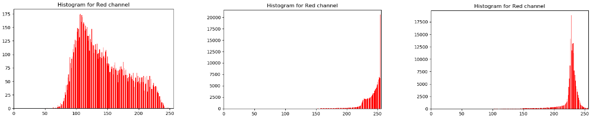

# Underwater-Buoy-Detection-Using-Gaussian-Mixture-Models
Color segmentation using Gaussian Mixture Models and Expectation Maximization algorithm.

# Stage 1: Data Preparation
## Step 1: 

While reading each frame from the Buoy video given, with the help of OpenCV mouse click helper functions we extract the buoys. To extract the buoys, using the mouse left click action, we select at least four extreme points on the circumference of one buoy in the given frame and press middle mouse button. This action extracts the points selected with the left click action and finds the centroid of the points and using the average Euclidean distance between the centroid of the given data points and the data points we draw a circle and extract the pieces of information and store it as an image file using OpenCV cv.imwrite function. Repeat the same for the other buoys in the frame once done with all the buoys of one frame press space key to start the same process with the next frame.

  

## Step 2:

After successfully extracting the buoys, sort them in appropriate folders( in this project the extracted buoys are in the folder ‘Crops’ - O, Y, G for orange, yellow, green buoys respectively). Once sorted, import the images in bulk and store in a numpy array for efficient manipulation later (refer import_images() from the BuoyDetection.py file). Using np.random.shuffle() shuffle the image’s order and pull and store 70% as training and 30 percent for testing. 

## Step 3:

 Extract all the data points with valuable information i.e exclude the data points that are zero or less than 50 ( zero means black pixels in the image, anything less than 50 is not a piece of valuable information). Store them separately and compute the histogram for all the color channels respectively as shown in fig 1.2. With the histograms, we can infer the number of Gaussian curves to fit the given histogram and ballpark the initial mean and variance by computing the same from the histogram data, which can be used as a start value for EM algorithm.

  
  
  

# Stage 2: Model Generation
## Step  1: Determine the number of Gaussians to fit for each channel.
To determine the number of Gaussians to fit for each channel, the shape of the average histogram of each channel (as shown in fig 1.2) was used for each buoy.
### Orange Buoy:
- Red channel: Since the red channel of the orange buoy has one narrow peak at around 250 and remaining data is spread, hence a bivariate Gaussian was used to fit this data.
- Green channel: Since the green channel of the orange buoy has two visible peaks, it was fitted using a bivariate Gaussian model.
- Blue channel: Similar to the red channel, blue channel has one visible peak and remaining data is spread, it was fitted using a bivariate Gaussian model.

  

### Yellow Buoy:
As explained in the orange buoy section, bivariate Gaussian models were selected based on the shape of the histogram of the channels of the yellow buoy.

  

### Green Buoy:
Similar to the orange and yellow buoy, the histogram of the channels referred to determine the number of Gaussians to fit. In this case, the red and the green channel were more spread hence three Gaussian functions were used to fit the data. For blue, only two Gaussians were used.

  

## Step 2: Generation of Gaussian Mixture Model using the EM Algorithm:

 EM algorithm was applied to each color channel separately. Depending upon the number of Gaussians required for fitting the data, some initial expected random means and constant variances were fed to the EM algorithm function to calculate the desired means and variances. Initially, it was assumed that each Gaussian distribution would have the same weight. (for example, for the bivariate Gaussian model, initial weights are taken as 0.5 and 0.5). 
    Using these starting values for mean, variances and weight, EM algorithm calculates the optimum values these parameters, by repeatedly calculating probabilities for each data points with respect each Gaussian distribution and using these new values to calculate the new mean, variance, and weights. This process is terminated when the difference in new and old values of the parameters is less than certain small constant. (In this case, 0.001 was used). 

* The yellow buoy was modeled using all three channels.
* The orange buoy was modeled using red and green channels.
* The green buoy was modeled using red and green channels.

# Stage 3: Buoy Detection and Segmentation
Step 1: Mask generation
    To distinguish the buoy pixels from the background following process was followed:
Using the mean, variance and weight values obtained using the EM algorithm, create a GMM model for each channel of the buoy.
For each channel, calculate the top 30 percent pdf values for the model, using corresponding means, variances, and weights.
Loop through each pixel of the current frame, and split it into three channels (R, G and B).
For each channel value, find the corresponding pdf value and check if it belongs to the top 30 percent pdf values calculated above.
If current pixel satisfies above condition for all channels used in the model, it is considered as the buoy pixel and it is colored as white. Otherwise it is colored as black indicating it belongs to the background. 

Step 2: Buoy Detection and Contour Drawing

 After getting the outputs from segmentation of the image by checking the conditions for the points that match a particular distribution or not and correspondingly assign a white or black color to that pixel, the output looks like figures below. Further, morphological operations were applied to the output, to remove the noise and focus more on the buoys. We first erode and then dilate the images to remove out the sparse noise and the thick regions of the detected buoy are preserved. Further, applying the dilation thickens the regions around the buoy. Upon finding contour of the largest region, we can fit a bounding circle around the detected buoy and that can be drawn on the original frame. All the processing was done frame by frame and then everything was combined to create a video using the OpenCV VideoWriter().

   
